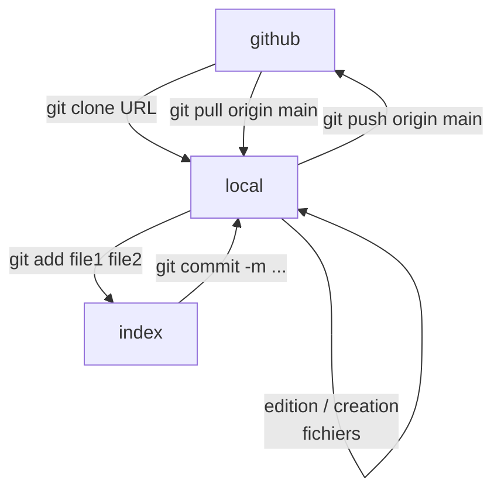

# test-univ-tours

Projet test pour montrer l'utilisation


Ce que le projet va permettre :


* Récupérer des messages
* les stocker en BDD
* les afficher
* utiliser Node-Red


Ajouter une image :


```flowchart TD
       mosquitto[serveur<br>Mosquitto] -->|messages| RPi[Raspberry Pi<br>Node-RED<br>Documentation]
       RPi --> BDD
       RPi <--> GitHub
```



